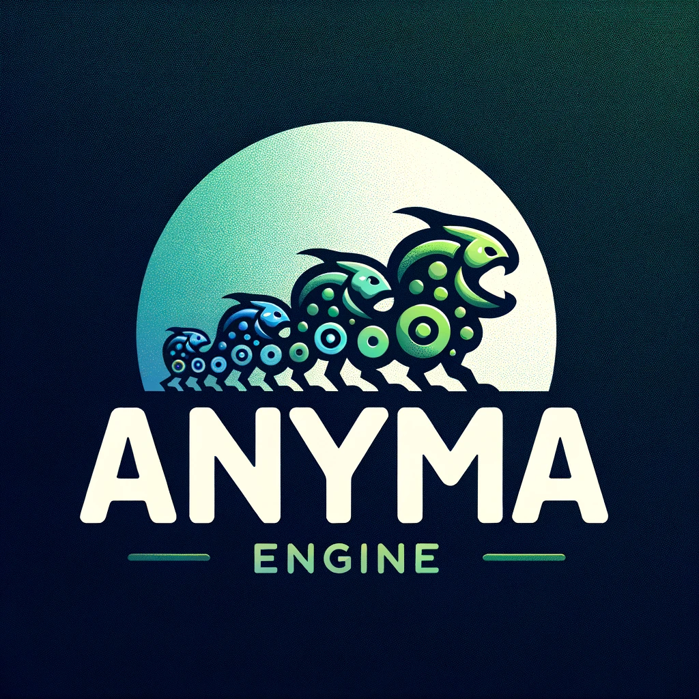

# AnymaEngine 

This will be the most large scale and fastest evolution simulation out there. 

Brain update rate will be 1 / 6 of the physics update rate.

## Building
~~Make sure you have cmake, vcpkg and all necessary c++ development tools for your operating system.~~

 Cmake is gone! Simply run build.bat in an x64 Native Tools Command Prompt (you get the x64 command window when installing visual studio).

 --- 

### Large scale TODO
 - Switch to HandmadeMath linear algebra library.
 - Break world up in chunks and process chunks using multithreading.
 - Make cute renderer.
 - Make the world absolutely huge and do processing by chunk offsets to prevent floating point errors.
 - Two pass collision solving.
 - Improve standard library: Add string type, better sorting.
 - Improve standard library: Make own multithreading primitives.
 - Build introspection and profiling tools.
 - Do real good collision detection, fix the fact that lots of agents are being checked twice. 
 - Do rendering on background thread such that the main thread doesnt block and feels smooth.
 - Saving and loading the state of an entire world.
 - Tracking succesful agents.
 - Tracking lineage.
 - Track generation number.
 - Showing the entire state of the brain and genes.
 - Make a circular buffer.
 - Port to webassembly and run online.
 - IDEA: Create a kind of business rule table where you can set rules like: 
    - Required speed for carnivores to do damage to herbivores
    - Allow sprinting, how much energy to take on a sprint?
    - Do carnivores get a reproduction boost if their population is low?
 - IDEA: Sensor: Average direction and distance of a certain type of agent in the neighbourhood as sensor. 
 - IDEA: Genetic playback, show entire evolution of phenotype as animation.

#### TODO
- Rebuild only phenotype when changing in editor.
- Turn editable parameters into a genome and generate the phenotype.
- Visualize mutations.
- Spawn multiple of these creatures in the editor.
- Refactor simulationscreen to use renderer. Do this gradually. 
- Smooth transition from top down to detailed rendering.
- Turn agent into entity? At least something such that collision detection and
  vision is possible between both plants and agents.
- Create food. Make bushes with berries and herbivore agents have to stand still and collect.
- Create tilemap and interpolate colors on the edges for biomes.
- Use perlin noise for terain and biome generation.
- Make decorations on the terain, rocks.
- Collision detection with solid tiles.
- Show work done per thread. Internal profiling tools.
- Build creature in local coordinates.

- Design mouth.
- Make graph in real seconds as units.
- FUN: Make a creature editor.
- Modular sensor and actuator system + editor.
- FUN: Make a mass-add feature.
- FUN: Make a mass-death feature.
- FUN: Make a mutation gun. Radiation.
- Change to local coordinates instead of fov, this is easier to work with. 
- Make boid-like inputs with average position and average velocity of nearby agents.
- Change charge such that they can charge partly and agents get feedback on the amount of charge they have. 
- Make carnivores brighter so you can see them better.
- Custom text rendering.
- Create simple entity system.
- STATS: Energy collected.
- Change rendering to 2.5D.
- Calculate frame update time and render time, use this to reccomend speedup or create adaptive speedup.
- Add terain.
- Show charge of agent in ui.
- OPTION: Change sensor info, give angle and distance of nearest same species and nearest opponent. 
- OPTION: Pheromones for herbivores.
- OPTION: Evolve possibility for pheromones.
- OPTION: Put food in the ground and signal food availablity by pheromones. LIKE ANTS!
- Make checkbox whether to show health bar in world.
- Show graphs of deaths and births.
- Store most succesful agents. (Requires herbivores to collect plants).
- Edit total lifespan of agents.
- Remove health bar in world with checkbox.
- Make grass fields , energy in ground.
- Configure amount of eyes and fov.
- Create real and simple memory pool with chunks
- Show indicator when herbivore is hurt.
- Edit reproduction rate calculation, more offspring if population is low for instance.
- Implement my own std::function.
- Plotting utility functions.
- Make active and inactive chunks.
- Fix agents popping into view.
- Draw scale with some text too. 
- Show agents in chunk in debug window. 
- Consistently call everything either draw or render. 
- Make random number generator.

### Done
- Edit creatures in an interface. Number of legs, hands, sizes.
- Make texture region.
- Global empty texture for convenience.
- Make list of common colors.
- Show charge when zoomed in.
- Throw away memory pools and use lifetime arenas for everything.
- Design eyes.
- Render a detailed agent in the editor.
- Walk cycle.
- Design legs.
- Make a camera looking down. 
- Create a renderer instead of passing all these meshes and textures around.
- Use textures to draw a circle.
- Get textures working and set default texture. 
- Get camera working in editor.
- Add different sensor type instead of eyes: nearest agent. 
#### RELEASE 4
- Remove CMAKE. I decided to use CMake for this project and i regret it. Very much. 
- Make particles when agent gets killed or dies.
- Show health when zoomed in.
- Recoil, or however you wanna call it when a herbivore is hurt. They cannot move unless they sprint?
- Use the charge or refractory value to disable movement for herbivore agents.
- Fix colors everywhere, follow imgui layout.
- Give carnivore agents a charge/attack procedure that is controlled by a neuron. This costs energy.
- Configure energy transfer on hit.
- Show overlays: Make coloring of genes to show genetic distance of different agents.
- Make color helper functions.
- Better agent selection, give feedback on agent hitboxes.
- Plot low dimensional version of genes.
- Draw active chunks.
- Compare two agent genes.
- FIX BUG: SelectFromWorld often has idx out of range.
- Highlight currently hovered agent.
- Create some background in the world, it looks boring right now. 
- Make neural network library.
- Implement alpha blending.
- Icons for imgui.
- Make a startup screen to start simulation with new persistent parameters.
- Turn off asserts when not debugging.
- Show number of workers and available threads. Make settings.
- Custom font for imgui.
- Show time also in seconds, not just ticks.
- Make agents squishy in direction of their velocity.
- Make carnivore attack.
- Collide herbivores and carnivores.
- Implement simple jobsystem.
- Do sensor updates and brain updates in parallel.
#### RELEASE 3
- More options for user. Spawn agents.
- Make mutation_rate adjustable in gui.
- Keep selection when moving camera around.
- Organize interface.
- Debug tools for memory arenas, check if clearing doesnt lead to problems.
- Implement 2 memory arenas for lifetime management.
- Make super simple brain.
- Agent lifespan.
- Agent asexual reproduction with mutations.
- Make cumulative graph of types of agents.
- IMPORTANT: Solve the huge memory leak in AddAgent.
- Remove agents.
- Pause simulation.
#### RELEASE 2
- Simple behavior.
- Setup screen to make new simulation.
- Show agent sensors when selected.
- Set debug option: Show chunks etc.
- Refactor main loop and main in general. Move to SimulationScreen.
- Show agent rays when selected.
- Show agent info in debug window.
- Raycasting for all eyes.
- Sort agents into all chunks they belong to.
- Draw grid in a more efficient way and in the background.
- Grid based collision detection for rays.
- Camera to world position.
- Make agents selectable.
- Handle collisions using chunks.
- Draw eye rays for selected agent.
#### RELEASE 1
- Create itch.io page.
- Asexual reproduction.
- Collect statistics about chunk occupancy.
- Only render visible agents.
- Divide the world into chunks.
- Update creature sensor info based on raycast (seeing).
- Do raycast;
- Do simple collision detection.
- Resize screen.
- Fix Array issues.
- Level of detail.
- Render eyes.
- Use N-gon to draw creatures.
- Sorting in Array
- Render N-polygon
- Make creature struct (Agent).
- Line rendering.
- Fix frame update rate at user specified FPS with SDL_Delay.
- Create window struct for platform handling.
- Render a creature.
- Implement scrolling.
- Move the 2D camera with WASD.
- Move the 2D camera with the mouse.
- Handle user input.
- Make a 2D camera.
- Make a basic 2D renderer.
- Import imgui with docking.

### Ideas
- For an overview of how the world is evolving, create a kind of sampling minimap. Dont render each individual creature but take a couple of samples for each pixel using the bsp-tree and take the average color. Store these frames and show as animation.
- Set business rules for evolution.
- Make interesting presets, make it easier for the user.

### Engine and more games.
- Move game-engine related stuff to different folder and turn into reusable game-engine.
- Create a game like super world box. Make complex behavior and create a behavior tree editor for fast iteration.
- Online game where you manage your little land and need to trade or fight with neighbouring countries. On a server WASM.

#### Design
- Current direction: Give agents a body, but at the same time simplify even more. 
- Gene encodes a body, rendered like football evo my previous project. The limbs will be connected to each other like spore, but its 2.5D.
- Sensors will be even simpler. Simply relative angle and distance to the nearest agent of the same type and of another type. 
- Bigger possible ruleset with agents that can send and receive signals.
- The goal of the simulation is to create an ecosystem that is interesting to
  look at. We might give agents properties like picking skills in an rpg. The
  total amount of points is capped. This way they can occupy an ecological
  niche.
  IDEAS for properties: 
  - Shield, less damage received.
  - Longevity.
  - Reproduction rate.
  - Speed.
  - Resistance in a certain biome.
  - Attack range.
  - Attack speed.
  - Attack force.
  - Pheromone placing.
  - Pheromone sensing.
  - Sexual reproduction.
  - (Maybe): Meat or plant preference for continuous evolution from herbivore to carnivore.
STYLE:
 - 2.5D and draw an outline around each creature so they are visible even if the background is the same color.

##### Plugin system
 - Lua or sth.

 ### BUGS
  - No agents leads to deadlock? SOLVED
  - Asserts still show in release.

 
